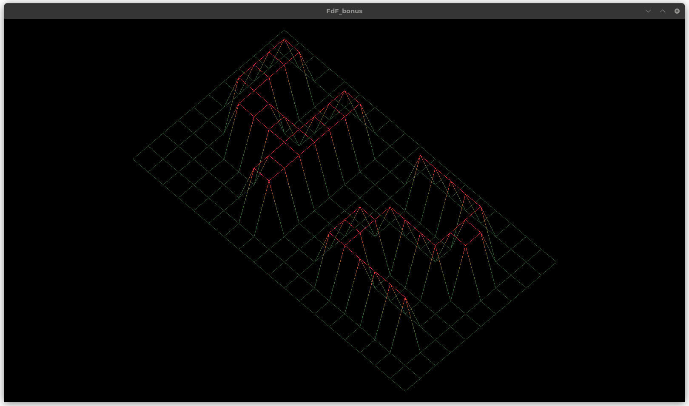
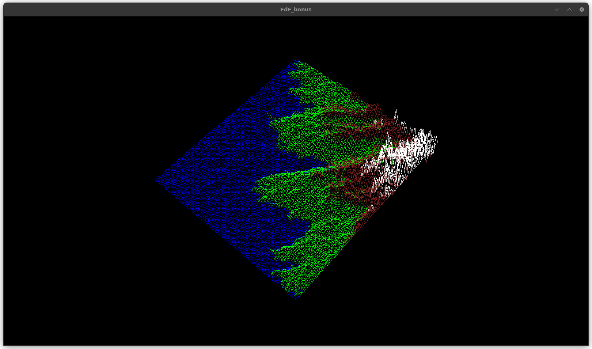
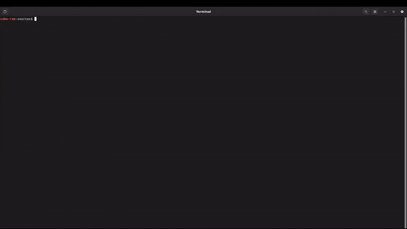

# 42SP_FdF
42's first basic computer graphics project

# FdF (Fil de Fer)

## Description
FdF is a program that renders an isometric projection of a 3D landscape.
It reads a file containing coordinates distributed in values ​​representing height or depth, and colors in hexadecimal format.

## Summary
- [Features](#features)
- [Installation](#installation)
- [Usage](#usage)
- [Examples](#examples)

## Features
- Representation of a 3D landscape using the Bresenham algorithm
- **Bonus:**
    - Gradient between two points with different colors
    - Model translation and rotation
    - Zoom in and zoom out
    - Two projections (isometric and top view)
    - Z-axis increment and decrement
    - Standardized colors for landscapes without color specification

## Installation

This project depends on the **MLX42** graphics library, which requires the following dependencies:

### In Linux (Debian / Ubuntu)

1. Install the required packages:
   ```bash
   sudo apt update
   sudo apt install build-essential libx11-dev libglfw3-dev libglfw3 xorg-dev cmake

2. Clone the project and compile MLX42:
	```bash
	git clone https://github.com/juncaroline/42SP_FdF.git
	cd 42SP_FdF/MLX42
	cmake -B build
	cmake --build build
	sudo cmake --install build

## Usage
To compile the project:

	cd sources
	make bonus
 
Para visualizar o projeto:
To visualize the project:

	./fdf_bonus ../test_maps/42.fdf

- Controls:
    - "=" : Zoom in
    - "-" : Zoom out
    - A : Y-axis rotation - counterclockwise
    - D : Y-axis rotation - clockwise
    - W : X-axis rotation - counterclockwise
    - S : X-axis rotation - clockwise
    - Q : Z-axis rotation - counterclockwise
    - E : Z-axis rotation - clockwise
    - U : Increase height (Z-axis)
    - F : Decrease height (Z-axis)
    - P : Isometric projection
    - T : Top View projection
    - Up arrow : Move the map up
    - Down arrow : Move the map down
    - Left arrow : Move the map left
    - Right arrow : Move the map right
    - ESC : Close the runtime window

## Examples





